# PIXIE
Orbital Project by [Team Teriri](https://github.com/FeathersRe/PIXIE)

## Propose Level of Achievement:
   
Apollo 11

## Project LOG:
Sir this way→[link](https://github.com/FeathersRe/PIXIE/blob/main/Project%20Log.md)

## User Manual:
Sir this way→[link](https://github.com/FeathersRe/PIXIE/blob/main/User%20Manual.md)

##  Project scope:
   
>We aim to deliver a standalone PC application, PIXIE, capable of processing image inputs initially in normal art forms, to pixel art outputs exhibiting characteristics of the user image, to assist game developers in creating content for non-profitable purposes.

Pixie will provide 2 different fully automated modes of conversion to deal with
common usage conditions.

Mode 1 - First Degree Conversion. Under this setting, the generated pixelated
outputs will largely preserve image details. Pixelation will focus on handling the input
image’s outlines and reducing colour steps, so as to resemble the basic
characteristics of pixel art creations. Technical focuses under this pillar will be the use
of image-processing libraries, particularly to accurately locate character outlines
through the use of colour gradient functions and by merging neighbouring pixels to
increase overall pixel size through image resizing. Considering the good preservation
of details in this conversion, end outputs will be especially useful in pixel game
dialogues and menu presentations.

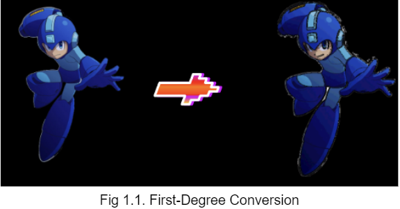

Mode 2 - Final Degree Conversion. In this mode, Pixie will aim to map the user input
onto our program’s general character template. To establish this, Pixie will rely on the
use of AI (with Stable Diffusion as the linkage platform between the image and an AI
model) to accurately lift out and collect information on important areas of the input
figure (eye colour, hair type etc.) Afterwards, these key areas are then simplified and
pixelated accordingly to be mapped onto our template with the help of a trained AI
model, so as to produce a specialised output template with reference to the user input. 
Technical focuses under this conversion will be the utilisation of Stable
Diffusion to produce the end product, as well as back-end linking of the platform to
our software to ensure users will be able to complete all operations by only our
program’s UI. Ideally, the simplified and easily made-to-move nature of end products
under this conversion will be very suitable in actual gameplay presentations.

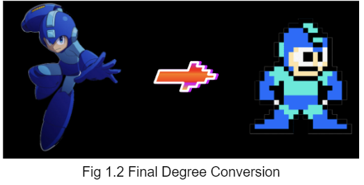

##  Core features established and changes in architecture
   
###  Changes in first-degree-conversion algorithms
A crucial step to completing first-degree conversion is being able to identify the
outline of the image.
Previously, our group utilised Laplacian Operators in the generation of the image’s
grayscale gradient map. This was a rather convenient method, as the Opencv Lib
had provided direct methods for the Operator, allowing users to be able to
straightforwardly obtain a usable gradient approximation just by calling its inbuilt
methods.

However, after numerous test trials, we realised that image outputs generated by this
method are not exactly ideal. Outputs often suffer from the issue of having their
edges identified way lesser than actual. This causes edge darkening algorithms that
come after to inaccurately process the outlining areas, showing unacceptable
instances where: 1) Supposedly consecutive darkening areas breaking apart. 2)
Certain lines were completely omitted in processing.
After intensive research, we found that Laplacian Operators are actually obtaining
estimates of the second derivatives of changes in pixel colours of an image in
cartesian coordinates. It has high tolerances towards changes in colour gradient,
specialising in only capturing abrupt changes in the image’s colour.

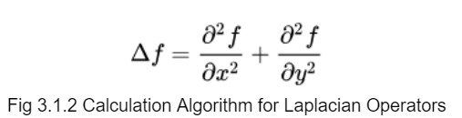

Though this could be ideal in cases where high sensitivity of the algorithm is required
(E.g. Identifying words from a document picture), for our purpose, especially when
there is generally high contrast between the background colours and the outlines,
such methods may instead have a negative effect and bring out a less accurate
depiction of the image outlines.

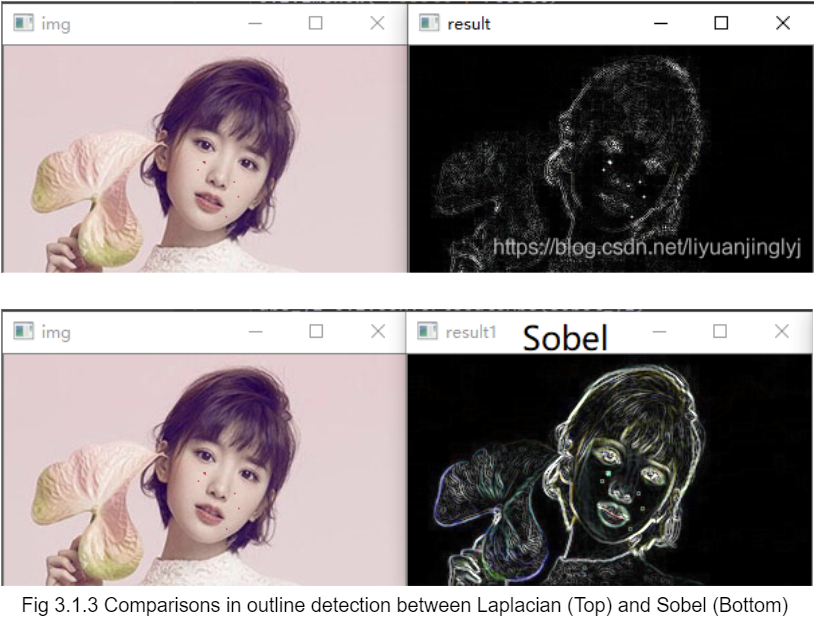

(Credits to: https://developer.aliyun.com/article/1108328)

Being fully aware of this difference, we decided to switch to the counterparts of
Laplacian Operators: Sobel Operators as it has a much desirable accuracy in
identifying the outline of the image for our purpose. As this method instead initiates a
2-D spatial gradient measurement in the detection of edges, the overall change in
gradient will have to further perform Pythagoras theorem on calculated gradients in
the x and y axis directions.

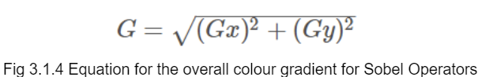

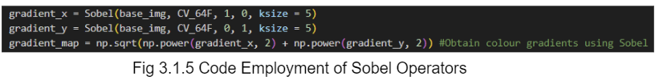

### Finalisation of first-degree-conversion processing modules

In our original attempt, we allowed two separate modules:1) Pillow image processing 2) OpenCV processing to be present for first-degree conversion. After numerous test trials, we realised that the OpenCV library, as compared to the Pillow image library, has more support towards mathematical methods such as Laplacian and Sobel operators, while too exhibiting important functions such as image resize and image display required for our program. In the idea to simplify our program flow, our team decided to fully employ the OpenCV library for our purposes. 

### Changes in User Control
Another major shift in our program architecture is that our program has moved from the original fully automated ideal to user-aided generation. This was a result of numerous trials of different test cases, where we realised that it is particularly difficult to set a common set of values for important variables (in our case, these are the relative pixel sizes, the accepted gradient difference, the resultant coloursteps and the degree of darkening for the edges). These are variables that largely link to the quality of our output produced, and the value settings between the acceptable criteria for two different pictures may also differ a lot. Deriving them solely based on the picture input also proved to be a tough road, as user may have their own preferences towards the output according to their needs and the values obtained by the system may not draw the entirely ideal output.

As such, we brought in the idea of a control panel in our design of UI. Key variables are now instead brought out of the CV2 program and set as inputs from the user. Users may now freely the variable settings and look for the most ideal output.

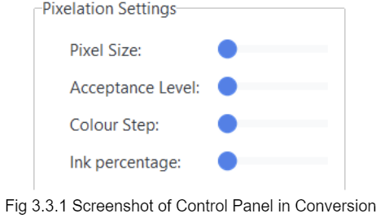

### Established features and changes in UI design
Lastly, the most noteworthy shift in our submission for milestone 2 is that we eventually finalised our development ideas for our software UI.

Originally, our team implemented PySimpleGUI as our choice of UI library. Though having the nature of being rather easy-to-start and convenient in rendering different UI sectors, we soon find the library to be a lacking choice of UI designing tool.

First of all, PySimpleGUI offers very little customisation choices. Despite it having a considerably large number of themes to choose from, most of them are only oriented amongst the change of colour. This largely limits the room for advanced customisation in intermediate UI designs, fundamentally restricting our program’s improvements on user visuals. 

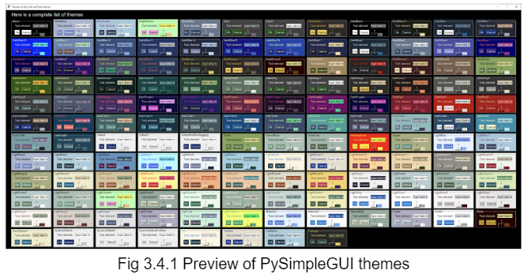

Secondly, PySimpleGUI is wired such that it has poor sector organisation. Different elements in a UI (E.g. Text, Button, etc) are treated as a single element and mapped onto the general frame. This results in rather tedious editing processes when it comes to editing all elements in the same organisation sector (E.g. the control panel in general), where separate changes will have to be done to all these individual elements to ensure a common UI style.

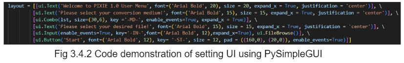

Lastly, PySimpleGUI does not offer flexible styles of layout. The coding of element layouts has to come in their actual reading order, and changes made to a single element (E.g. Changing the length of a text element) could entirely mess up the user interface due to the absence of further adjustments to the layout padding. This creates numerous inconveniences especially in the development phase, as new ideas are being consistently added in and changes to spacing have to be made to ensure the interface remains reasonable.

Being aware of such drawbacks, our team actively sought for an alternative amidst our development of the UI interface. As a return to our efforts, we find the ttkbootstrap module, developed based on the widely praised Python UI design library tkinter, to be a much better choice for our purposes.

Firstly, ttkbootstrap provides evident changes to the system UI as the theme changes. This not only ranges from the color setting of basic elements but also extends to the more subtle aspects of a software UI such as the contrast between a sector colour and the overall background colour. This makes design variations in UI development using python tremendously diverse as compared to using PySimpleGUI, thus facilitating more room for our continued refinement of system UI.

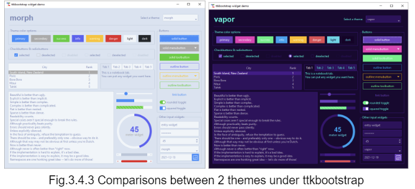

Furthermore, ttkbootstrap introduces the concept of parent and child UI frames. The function of parent frames is identical to the purpose of a mainframe in PySimpleGUI, however, the concept of child frames allows users to have an extra step forward to unite all linking elements into a single sector, allowing possible operations of uniformly changing the UI style of an entire sector to occur.

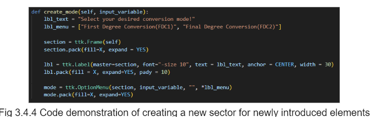

Finally, ttkbootstraps entirely shifts from coding solely based on the reading sequence of elements to flexible coding. With the introduction of useful layout management methods such as pack() and grid(), users are able to organised the arrangement of sectors based on useful settings (such as grid coordinates) and place different portions of the software into the menu like a jigsaw puzzle, largely eliminating the possibility of obtaining the wrong element sequence due to the execution sequence of the code. On top of that, the layout of the UI also response instantaneously by taking into account the size of neighbouring sectors. This effectively avoids changes in a different sector messing up the whole layout, effectively reducing the workload for programmers to especially pay attention to padding.

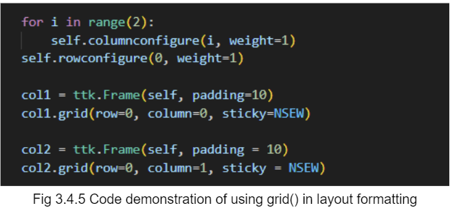

The transition from PySimpleGUI to ttkbootstrap brings a paradigm shift to our program development, as it also marks an architecture change from function-based procedural programming to Object-Oriented procedural programming. With the foundation of the structure being set in this stage, future improvements on UI will be easily adapted to the system.

## Problems encountered and possible areas for improvement

### Control Panel Interface

One issue with our current UI system is that the control panel is not entirely clear in its value setting (refer to Fig 3.3.1). Despite it including commonly seen interaction features such as the scale bar for users to tweak with the variable values, we encountered quite a lot of difficulties in the attempt to further add in a numerical display alongside to scale to help the user have a clearer understanding of the current setting set.

The first issue encountered is executing reasonable truncation to the numerical display. Due to how ttkbootstrap wires its scale bar element, the actual value obtained from the user interaction with the scale bar is very precise and can go up to many decimal places within the scheduled range. Also due to its flexible display nature, if untruncated, the decimal places of the numerical display will still be entirely shown, however, compressing other sectors. However, our attempt on truncating directly on ttkbootstrap’s variable does not yet seem to work. (Still in the progress of debugging round(IntVar()))

Another issue with the numerical display is instantaneous updates. As the user scales the bar to a new position, reflecting this change onto the numerical display is quite a confusing issue. Typical text display in our current ttkbootstrap practices has its value set once at the beginning of the program as a result of the __init__() function. How to make amendments to the original rendered template to change the values is still under exploration.

### Picture Preview

Another issue with our program is that we originally ambitiously set to complete an instantaneous picture preview, where the program is able to fetch the rendered picture and update the current preview after a user executes the render function. However, very similar to the issue with numerical displays, picture displays also have their resources set thanks to the __init__() function which will only execute once at the original call of the class. How to slide in later updates of the picture resource is also under exploration.

## Tech Stack

### Necessary Requirements
To execute PIXIE , you’ll need a Python of version 3.7 and above, and the following Python libraries.
#### -OpenCV
#### -Numpy
#### -ttkbootstrap
Do make sure they are installed prior to the execution.

