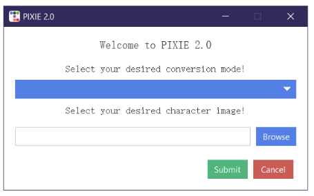
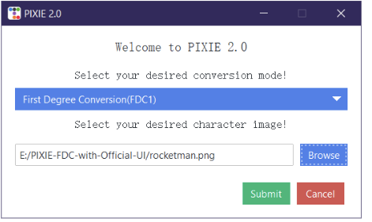
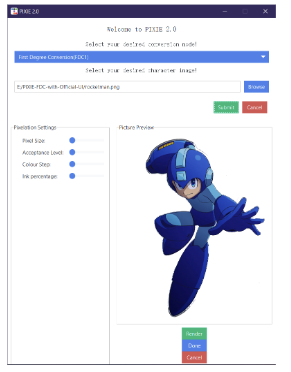
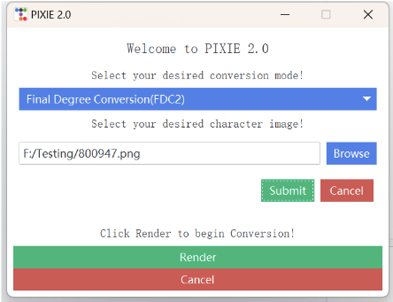

# USER MANUAL

## Hardware Requirements
PIXIE utilises AI image rendering algorithms which could take a toll on low-end machines. To ensure a favourable usage experience, we would highly recommend the the program to be functioning on a device with following specs: 
- CPU:  Any modern AMD or Intel CPU
- RAM: A minimum of 16 gigabytes of DDR4 or DDR5 RAM
- Storage: Any SATA or NVMe solid-state drive from a reputable company that is 256 gigabytes or larger. You need at least 10 gigabytes of free space available. Typically, one terabyte drives offer the best price per gigabyte of storage.
- GPU: Any GeForce RTX GPU with a minimum of 8 gigabytes of GDDR6 memory.

## Installation Guide

### Necessary Software Platforms/Libraries
To execute PIXIE, you will need the following platforms/libraries (they can mostly be installed with PIP):
- A Python of version 3.10 (Higher versions exists compatibility issues with Pytorch)
- Pytorch (compatible with CUDA 11.7)
- Diffusers (https://github.com/huggingface/diffusers)
- Transformers (https://github.com/huggingface/transformers)
- Deepdanbooru (https://github.com/KichangKim/DeepDanbooru)
- Tensorflow
- Tensorflow-io
- Click
- Requests
- Scikit-image
- Six 
- Pillow
- Numpy
- OpenCV
- Ttkbootstrap

### Necessary AI models
Apart from the library requirements, AI image processing also forms an integral portion of PIXIE’s functions. The following section will walkthrough how required modules will be installed in the program’s execution.

#### Stable Diffusion V1.5 Base model (Loaded to diffusers)
- Obtain a checkpoint file of the V1.5 based model. (For our purposes the pruned-emaonly file is sufficient) (v1-5-pruned-emaonly.ckpt)
- In the Diffusers library’s directory, find convert_original_stable_diffusion_to_diffusers.py. In your command panel, execute
python ./scripts/convert_original_stable_diffusion_to_diffusers.py --checkpoint_path xxx.ckpt  --dump_path save_dir to load the model into diffusers format.
- Move the resulted output to PIXIE’s directory, under the sd_model folder.This will mark the successful installation of the Stable diffusion base model.
  

#### Deepdanbooru model (https://github.com/KichangKim/DeepDanbooru) 
The Deepdanbooru AI model can be either installed directly or trained from scratch. For this user manual, we will only cover the direct installation procedures
- Look for the DeepDanbooru Pretrained Model v3-20211112-sgd-e28 model under releases. Download the corresponding file.
- Unzip all contents of the file to PIXIE’s directory, under the deepdanbooru_model folder.This will mark the successful installation of Deepdanbooru’s AI model.

#### Lastly, PIXIE will require a LORA model to ensure consistent image outputs. 
For our purposes, we selected the pixel character model from Civitai by afei520 (https://civitai.com/models/72144?modelVersionId=76904)
- Download the Lora model.
- Unzip all contents of the file to PIXIE’s directory, under the lora_model folder. This will mark the successful installation of the Lora model.

## User Guide

1. To execute PIXIE, open PIXIE as a folder and click on the Main.py file to initiate the program. The following interface should appear.

2. Select your desired Conversion mode and image. Click submit to continue. (It is best that the desired image is of the ‘.png’ format, so as to maximise compatibility

### First Degree Conversion

1. If the selected mode is FDC1, the following interface should occur. Adjust the few variables to your desired value and click render to continue.

2. The values could be changed and rendered again  if you are not satisfied with the end result. If everything is fine, click on Done and look for the output in the Output folder (under the current working directory).

### Final Degree Conversion

1.  If the selected mode is FDC2, the following interface should occur.

2. If you are prepared to start the conversion, click on Render. The following notification should pop-up to notify the beginning of the process.

3. When the process is completed. The following notification would pop-up to notify the end of the process.

  

